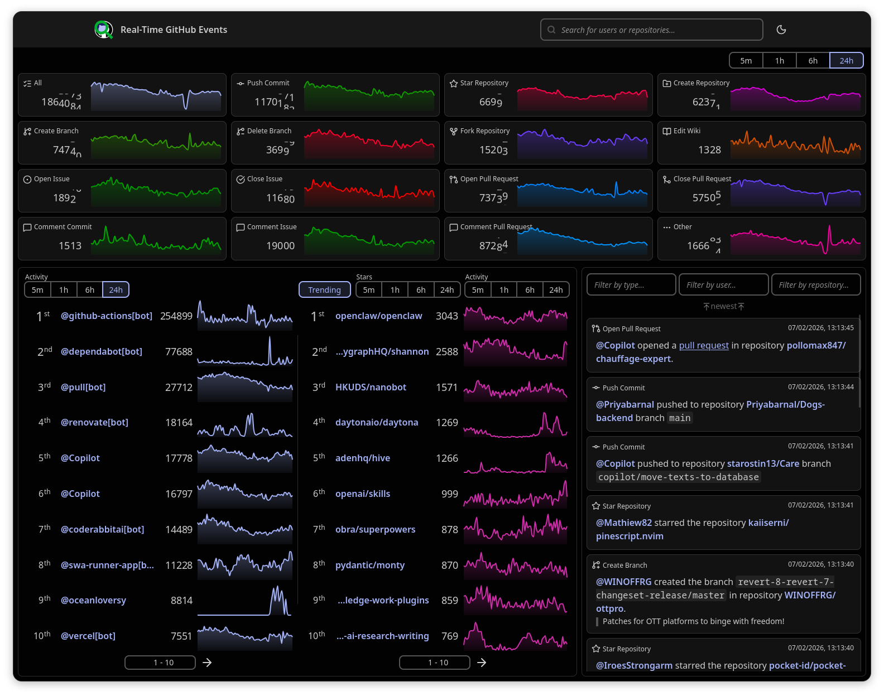
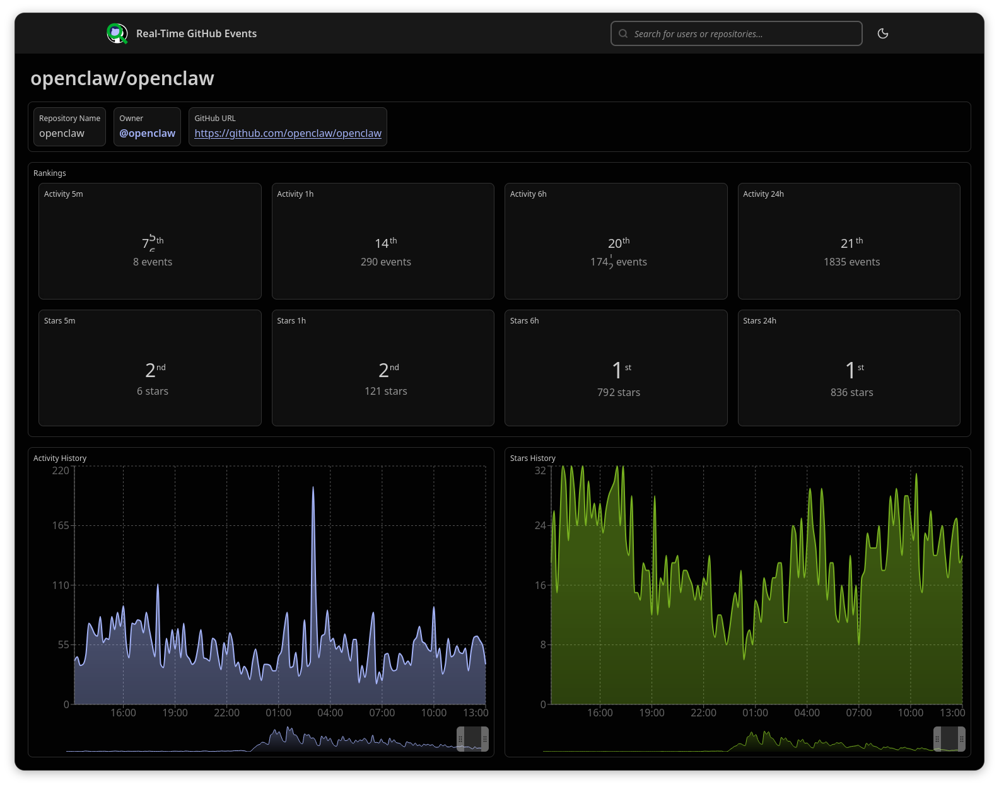
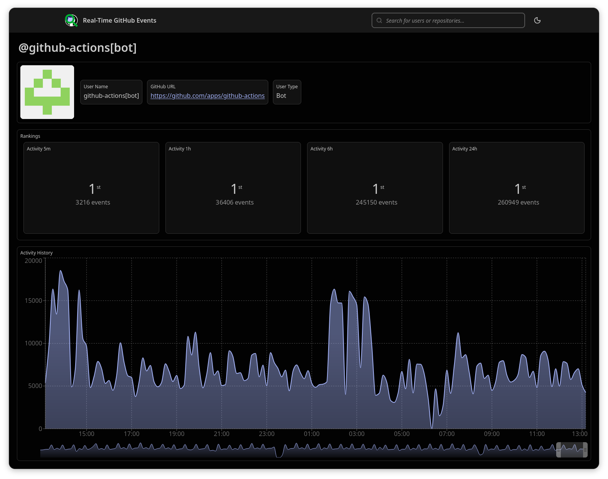

Real-Time Analysis of Public GitHub Activity
============================================

## Key Project Deliverables

For evaluation purposes, the most important files are:

* **Source Code:** `app` - Contains the complete source code for the project. It contains a number of different subdirectories for the different components.
* **Project Report:** `report/main.pdf` - The comprehensive project report.
* **Final Presentation Slides:** `presentation/main.pdf` - The slides for the final project presentation.

A version of the system is hosted at http://rtgh.rolandb.com/, but note that since it is hosted by me from home, it may not be up 100% of the time.

## Project Overview

This project provides a real-time dashboard for monitoring public activity on GitHub.

The application captures and analyzes a continuous stream of public events from the [GitHub Events API](https://docs.github.com/en/rest/activity/events) to provide insights into ongoing open source development trends. The application offers a live dashboard that visualizes the data by processing it in real-time. In addition to the main dashboard, it also includes dedicated pages for specific event kinds, specific repositories, and specific users.

Some more details about the architecture, running the application outside docker, and the API used between the frontend server and client can be found here:
* [Architecture](docs/architecture.md)
* [Development](docs/development.md)
* [API](docs/api.md)

### Key Features

* **Live Event Feed:** A filterable, real-time stream of events, allowing users to filter based on event type, username, or repository name. Events are lightly processed to provide a human-readable description.
* **Real-Time Event Counters:** Dynamic counters displaying the volume of different event types (e.g., commits, issues opened, forks, etc.) over sliding time windows, such as the last 5 minute, hour, or day.
* **Activity Leaderboards:** Continuously updated rankings of the most active repositories and users. This is calculated based on the number of events over multiple sliding time window, such as the last 5 minutes, hour, or day.
* **Trending Repository Detection:** Identification of repositories that are rapidly gaining popularity. This is achieved by analyzing the rate of new stars over different sliding time windows.

### Project Structure

The project is organized into the following directories and key files:

```
├── app/                    # Contains the source code for the application.
│   ├── docker-compose.yml  # A docker compose file orchestrating the services of the application.
│   ├── flink/              # Custom configuration and Dockerfile for the flink containers.
│   ├── frontend/           # Directory containing the frontend components.
│   │   ├── ...             # The root of this directory contains the code for the frontend server.
│   │   └── web/            # This subdirectory contains the web application part of the frontend.
│   ├── ghdummy/            # Directory containing a dummy server replicating the GitHub Events API. For testing only.
│   ├── pgadmin4/           # Directory with pgadmin related configuration.
│   ├── postgres/           # Directory with the SQL script to initialize the PostgreSQL database.
│   ├── processor/          # Directory with the code for the Flink based processor.
│   └── producer/           # Directory with the code for the custom Kafka producer.
├── scripts/                # Some miscellaneous scrips.
├── proposal/               # Initial one-page project proposal (LaTeX).
├── presentation/           # Final project presentation slides (LaTeX).
├── report/                 # Full project report (LaTeX).
├── docs/                   # Some additional documentation in markdown.
└── README.md               # This file.
```

## Setup, Installation, Usage

Before starting, you should download the repository locally by running the following commands:

```bash
git clone https://gitlab.inf.unibz.it/Roland.Bernard/rtbdp-project
cd rtbdp-project
```
or
```bash
git clone https://github.com/rolandbernard/rtbdp-project
cd rtbdp-project
```

You can run this project either outside Docker, or by using the provided Docker Compose configuration file. Using the Docker Compose configuration is most likely going to be easier. However, for some components, it will be easier for development to run them outside of docker.

*Note: The project has only been tested on Linux (Fedora 43) running on x86-64 hardware.*

### Using Docker Compose

First, navigate to the `app` directory using `cd app`. Then, copy the `.env.example` file to `.env` using `cp .env.example .env`. You may change any of the configurations in the `.env` file, by default the `.env.example` file will start all components of the project inside docker. Change `COMPOSE_PROFILES` if you want to run only a subset of the components within docker. Feel free to modify any other variables in `.env` to fit your needs.

Note that by default the configuration in `.env.example` will be using the dummy GitHub Event API server. This is because using the real GitHub Events API will require an access token. If you want to switch to using the real GitHub API, change `GITHUB_URL` to `https://api.github.com` and `GITHUB_TOKEN` to your personal GitHub access token (you can generate one on GitHub under `Settings > Developer Settings > Personal access token`).

Assuming you have Docker and Docker Compose installed on your machine, getting this project up and running, after the configuration steps above, should be as easy as running `docker compose up` in the `app` directory of this project. The Docker Compose file contains the services for all components of the project. Subsequently, it will automatically start the web server that will be available at `http://localhost:8888`, unless you changed the related configuration in `.env`.

### Running Outside Docker

For information about running the application outside of docker, mainly useful for development, see [Development](docs/development.md).

## Screenshots of the User Interface

### Home Page


### Event Kind Page


### Repository Page


### User Page

