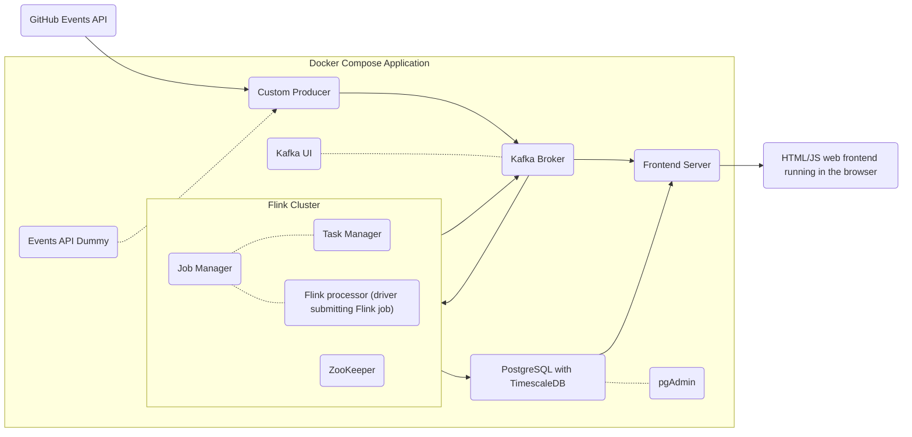

# Architecture

The application is composed of several services, orchestrated by Docker Compose. An overview of the complete architecture is shown in the below diagram.

## Services

Below is a description of all the services that are part of this project.

* **Kafka**: A distributed streaming platform used for building real-time data pipelines.
  * `broker`: The Kafka broker.
  * `kafka-ui`: A web UI for managing Kafka.
* **PostgreSQL**: A open source object-relational database system.
  * `postgres`: The PostgreSQL database, with the TimescaleDB extension for time-series data.
  * `pgadmin`: A web UI for managing PostgreSQL.
* **Flink**: A framework and distributed processing engine for stateful computations over data streams.
  * `flink-jobmanager`: The Flink JobManager.
  * `flink-taskmanager`: The Flink TaskManager.
  * `zookeeper`: Used for high availability.
* **Application**: The project-specific services.
  * `ghdummy`: A dummy GitHub API for testing. Useful because it does not require a real GitHub access token.
  * `producer`: Polls the GitHub API and pushes events to Kafka.
  * `processor`: A Flink job that processes events from Kafka and writes the results back to other Kafka topics and to PostgreSQL.
  * `frontend`: Serves the web UI and provides a WebSocket connection for real-time updates. Accessed data in the PostgreSQL database for historical data and Kafka for real-time updates.

## Data Flow

1.  The `producer` service polls the GitHub Events API for new events.
2.  The events are published to a Kafka topic called `raw_events`.
3.  The `processor` service, a Flink job, consumes the events from the `raw_events` topic.
4.  The Flink job processes the events in real-time, performing aggregations and calculations to derive meaningful analytics.
5.  The results of this processing are written directly to a PostgreSQL database, which is enhanced with the TimescaleDB extension for efficient time-series data management.
6.  The results are further written to different Kafka topics for real-time updates in the frontend.
7.  The `frontend` service acts as both a web server for the user interface and a WebSocket server for real-time data delivery.
8.  When a user opens the web application, the `frontend` service queries the PostgreSQL database to retrieve the initial data for the dashboard.
9.  The `frontend` service then uses the Kafka topics to push real-time updates as new data is processed by Flink. This ensures that the dashboard remains synchronized with the latest GitHub activity.

